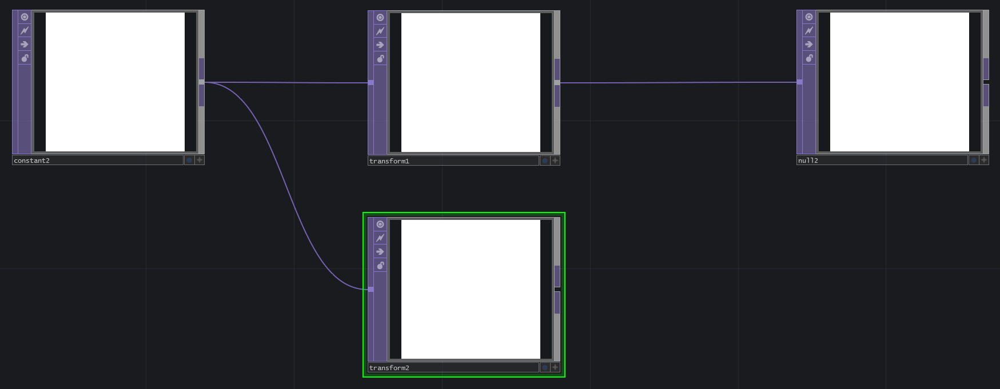

## *1.2 Creating Operators*

The OP Create Dialog can be reached in a multitude of ways. Each has a correct time and place of usage. When creating Operators from scratch the two easiest methods are to hit ’Tab’ on the keyboard, or to double click on the Network background.

When working with existing chains of Operators, there are two easy ways to add Operators. The first is to right click on either the input or output of an Operator. This will add the chosen Operator, pre-wired, directly before the input or after the output. This is especially useful as it inserts the Operator seamlessly into a pre-existing chain.

For example, there is a Constant TOP wired to a Null TOP, and a Transform TOP needs to be added between the two. Right clicking either the output of the Constant TOP, or the input of the Null TOP, and selecting Transform TOP, would create a Transform TOP, that would be pre-wired in-between the Constant TOP and Null TOP.

The second way to add an Operator to an existing chain is to middle click on the output of an Operator. The difference is that right clicking integrates the newly created Operator into the current Operator chain, whereas middle clicking creates a new branch in parallel to the chain of Operators.

Similar results can be achieved by right clicking on the wire itself and clicking on ’Insert Operator’ or ’Add Operator’. ’Insert Operator’ acts like right clicking an Operator’s output and integrates it into the current Operator chain, whereas ’Add Operator’ acts like middle clicking and creates a new branch in parallel to the chain.

In the diagram below, there is an example with a Constant TOP and a Null TOP. In the next diagram, the wire connecting them was right clicked and a Transform TOP was created using ’Insert Operator’. In the proceeding diagram, the wire connecting the Operators was right clicked and a Transform TOP was created using ’Add Operator’. Notice how it is pre-wired in parallel to the first Transform TOP.

There are two useful key commands when working with the OP Create Dialog: ’Control’ and ’Shift’. Open the OP Create dialog, hold down ’Control’ on the keyboard, and then begin to select multiple Operators in a row. Each one will be added to the Network below the last. This is useful for quickly populating a Network with a few different Operators.

Similarly, open the OP Create dialog, press and hold the ’Shift’ key, and then begin to select multiple Operators. This is different than above, in that the Operators will be wired together in series. This key command can be used to quickly create small, or large, chains of pre-wired Operators.

Both of these key commands are quite powerful, but they become even more so when they are used
in tandem. For example, a project requires 3 chains of Operators. The first will consist of a Circle TOP, connected to a Blur TOP, connected to a Null TOP. The second will consist of a Circle TOP, connected to an Edge TOP, connected to a Noise TOP, connected to a Null TOP. The final chain will consist of a Movie In TOP, connected to a Blur TOP, connected to a Null TOP. Let’s go through this step by step, to demonstrate practical use of the above key commands:

1. Open the OP Create dialog

2. Press and hold down ’Shift’

3. While holding ’Shift’, click on Circle TOP, Blur TOP, then Null TOP. This will create the first chain.

4. Release the ’Shift’ key

5. Press and hold down ’Control’. This will place the next Operator below the first Operator.

6. Holding ’Control’, click on Circle TOP

7. Release the ’Control’ key

8. Press and hold down the ’Shift’ key

9. While holding ’Shift’, click on Edge TOP, Noise TOP, and then Null TOP. This will create the second chain

10. Release the ’Shift’ key

11. Press and hold ’Control’

12. While holding ’Control’, click on Movie In TOP.

13. Release the ’Control’ key

14. Press and hold ’Shift’

15. Click on the remaining operators: Blur TOP, and Null TOP

16. Now that all of the Operators are created, use the ’Esc’ key to close the OP Create dialog.

After closing the OP Create Dialog, all the required Operators will be wired and ready to go in the project. These key commands have not only saved having to open and close the OP Create Dialog for every Operator, but they’ve saved the need to manually wire them.