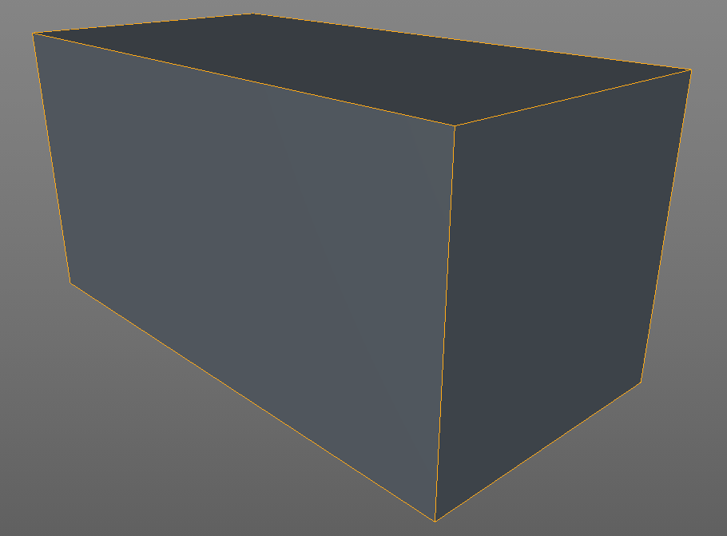

## *8.3 UV Maps*

UV mapping is an essential to working with complex 3D geometry. As with certain other aspects of 3D modelling, it is easier to create and work with UV maps in a dedicated modelling program.

UV mapping is what allows designers and artists to create interesting motion and still graphic textures for 3D geometry. It bridges the 2D world that motion and still graphics are created in with the 3D world of the geometry. 

UV mapping is a three-step process. The first step is the unwrapping of the 3D object into a 2D plane. This unwrapped texture is called a UV map. It is referred to as a map, because much like any other type of map, it takes a 3D object and accurately, and proportionally, creates a 2D reference. This is the same as street maps or world maps, that take the 3D universe and represent them on a 2D plane.

Texturing is the the second step. The 2D UV map is used by artists and designers in their compositing softwares to create textures, whether still or moving. The benefit of the UV map is that the textures can be applied to the geometry with a high degree of precision.

The third step is the application of the texture onto the 3D geometry. This varies depending on the software used.

The combination of these three steps are referred to as UV mapping.

The third step is a relatively common operation in TouchDesigner. As long as the 3D geometry is exported correctly from its modelling software, it will include co-ordinates indicating to other applications where the UV maps should be applied. In these situations the texture is loaded in a Movie In TOP and applied using a Phong MAT to the geometry. If any changes need to be made to how the UV map is applied, the Texture SOP can be used. 

Below is an example of a simple 3D box, and it's UV map:

