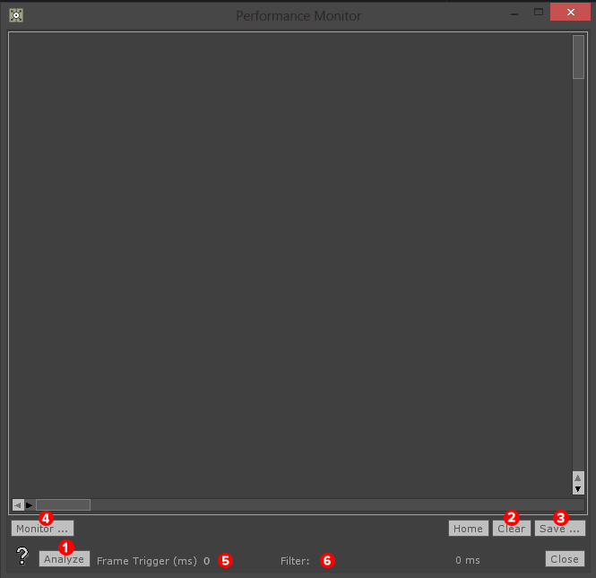
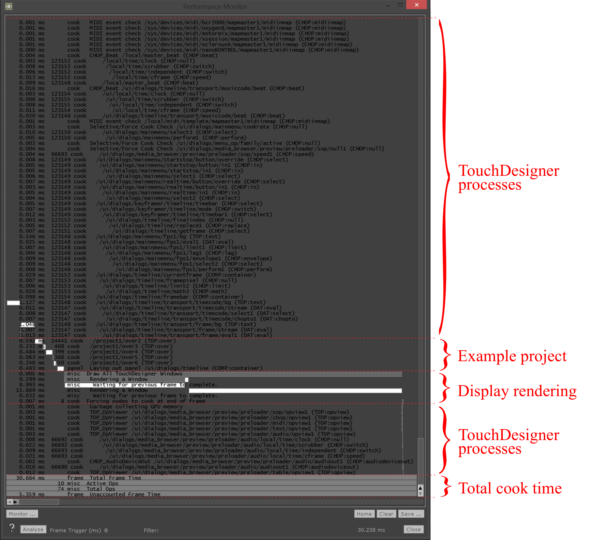

## *11.3 Using Performance Monitor*

The Performance Monitor is a tool for analyzing the cook time of a frame. This is useful when trying to optimize and debug a project's performance.

There are three ways to access the Performance Monitor: 

1. 'F2' on the keyboard

2. 'Alt + Y' on the keyboard

3. Clicking 'Performance Monitor' under 'Dialogs' in the menubar at the top of the screen

There are only a few buttons, and they perform simple tasks that are almost self-explanatory.

1. Performs an analyses on the current frame

2. Clears the current results

3. Saves the current results to a text file

4. Change what is being monitored

5. A millisecond threshold value, which if crossed by a frame's cook time, will trigger the Performance Monitor to analyze

6. Filter the results for more precision, i.e. only CHOPS, TOPs, etc

It is important to note that cook times are based on the CPU. This doesn't mean GPU bottlenecks will go unnoticed in the Performance monitor, but be cognizant that these are CPU readings. 

Here is an example analyses from the Performance Montior.

The analyses above is taken from a simple project with a few Movie In TOPs and a few Over TOPs. Every frame that is analyzed will have some similar Operators. These are the Operators responsible for the functionality and user interface elements of TouchDesigner.

Look at the marked sections on the above diagram to see the cook times, and paths, for the Operators responsible for TouchDesigner's main functionality (User interfaces, dialog windows, etc), and more importantly the Operators belonging to the example project. The cook time of each Operator is represented by a white bar that is sized proportionally based on its contribution to the total cook time of that frame. When projects grow and become more involved, the section labeled 'Example project' will grow to include all of the project's Operators. This allows the analysis of a project to find problem Operators that too many system resources. 

In this example, the paths and cook times of the series of Over TOPs can be traced. They are all located inside of the 'project1' container, and their cook times range from 0.06 milliseconds to 0.6 milliseconds.  

A cautious side-note: Be careful of the effects of Vertical Sync and how cook time is perceived in the Performance Monitor. The graphics card will try to lock project FPS and display refresh rate. At 30 FPS, even in an empty project, the cook time per frame might be perceived as 33 milliseconds. The same effect can occur when working at 60 FPS, except that the Performance Monitor would show a frame cook time of 16 milliseconds. This doesn't mean that each frame actually needs a full 33 ms or 16 ms to render a frame, but that Vertical Sync is trying to sync TouchDesigner's FPS and the refresh rate of the displays. 