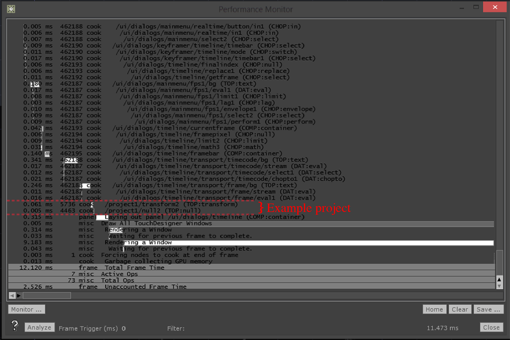

## *11.4 Operator Cooking*

Better performance can always be achieved by decreasing the amount of Operators that cook every frame. Many beginners never take this into account when creating Networks. Admittedly, everyone has worked on prototypes with tight deadlines, and has had to created Networks without much foresight. However, not taking cooking into account can be quite hazardous if a project can't afford any dropped frames.

The main goal is to perform static operations as early as possible in the signal flow, to prevent those specific from being rendered every frame.

Open example 'Cooking\_1.toe'. In this example, there is a simple graphic that rotates, and then various Operators are used to give the image a more interesting look. A feature that can help with optimizing Networks is the animation of the wires connecting Operators. Animated wires mean that the Operators on both ends are being cooked every frame. Starting at the far left of the Network, the wire between the Movie In TOP and the Transform TOP is not animated. This is because the image is loaded, and remains static. Operators only cook when they need to perform an operation or change. A still picture is static, and therefore does not change, and does not cook every frame. 

On the contrary, the rest of the wires in the Network are animated, meaning that everything after the Movie In TOP is cooking every frame. For this project, this isn't a dire problem, because there isn't anything extremely complex happening. Getting in the mind set of making efficient Networks from the start can save a lot of headaches come performance time. Let's take a look at this project in the Performance Monitor. 

Ignoring all the Operators needed for TouchDesigner's functionality, there is a small block of Operators dedicated to this example. The operations being performed on the image, in total, take about 0.25 milliseconds. As mentioned, static operations only need to cook once, and something to note is that many of the operations after the Transform TOP are  static in nature. Let's re-arrange these and see the gains in performance.

Open example 'Cooking\_2.toe'. This project is the same as the previous, except the Operators have been re-arranged. Before examining the signal flow closer, let's take a look at the Performance Monitor.

At first glance it appears as if the project has shrank! A few of the Operators that were listed previously have disappeared. This is because these Operators aren't cooking every frame. In the last example, the Transform TOP was performing a transformation every frame, forcing the TOPs after it to recalculate their operations every frame. In this example, all of the static operations happen at the start of the signal flow, leaving the Transform TOP free to perform its transformation, without forcing any other Operators to recalculate their operations, or cook.

Taking a more in depth look at the Performance Monitor reading, the only Operator that was cooked was the Transform TOP, which took 0.061 milliseconds to cook. Compare this to the previous example, where the series of operations took 0.25 milliseconds to cook. That is an unbelievable gain for such a simple change.

It is worth noting that side by side, the outputs of these two Operator chains may not be exactly identical, but they are so indistinguishable from each other that many clients and artists will not mind the difference, knowing that the massive performance gains will allow them to do so much more.